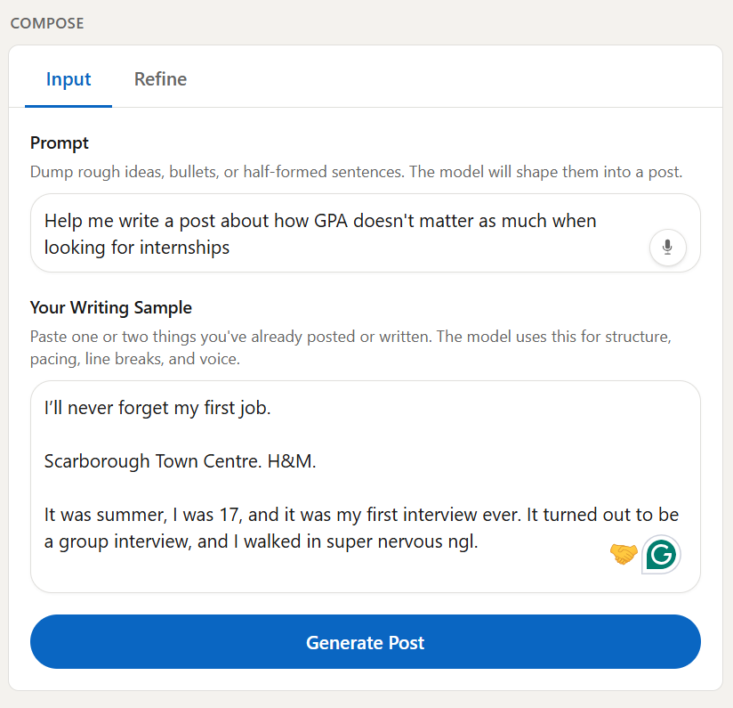

# PostedIn

**PostedIn** is a **LinkedIn-style writing assistant** that turns rough notes into a polished post you can tweak in place. You describe your ideas in a **Prompt**, optionally paste a **writing sample** so the model matches how you write, then **generate** a draft that streams into a feed-style **preview**—so you see it come together like it would on LinkedIn, not in a chat transcript.

Refine the copy with natural-language requests, **jump back to earlier drafts** if you change your mind, and use quick actions like **Improve hook** or **Sound more like me** (when you’ve added a sample). You can **dictate** into the Prompt and Refine fields with your browser’s microphone where supported.

Bring your **own OpenAI API key**; nothing is stored in a database—draft history for refinements lives in the browser for that session only.

**Demo:** Instead of a throwaway hosted page, **[see PostedIn in context on LinkedIn](https://www.linkedin.com/)** — replace that URL with your showcase post when you publish.

<p align="center">
  
</p>

## Project Overview

PostedIn helps you go from messy thoughts to a post-ready draft. The screenshots below follow **the order you actually use the app** — drop matching files into `public/` when you capture them.

<p align="center">
  
  <br>
  <b>Figure 1: Full overview — nav, compose rail, and LinkedIn-style preview so readers instantly see the whole loop.</b>
</p>

<p align="center">
  
  <br>
  <b>Figure 2: Compose rail — the Input / Refine tabs and the column where you spend most of your time before the post exists.</b>
</p>

<p align="center">
  
  <br>
  <b>Figure 3: Prompt area with the mic — dump bullets or ramble out loud; the sample field can sit in the same shot if it reads cleaner.</b>
</p>

<p align="center">
  
  <br>
  <b>Figure 4: Output preview — the feed-style card where the draft lands and streams in, so it feels like LinkedIn, not a chat bubble.</b>
</p>

<p align="center">
  
  <br>
  <b>Figure 5: Under the card — Copy, Regenerate, Improve hook, and Sound more like me in one frame so the “what do I click next?” story is obvious.</b>
</p>

<p align="center">
  
  <br>
  <b>Figure 6: Refine tab — the focused thread for “make it shorter,” “punchier CTA,” and the rest of the surgical passes.</b>
</p>

<p align="center">
  
  <br>
  <b>Figure 7: Draft history — chips and restore so people see how you rewind when a refine overshoots.</b>
</p>

<p align="center">
  
  <br>
  <b>Figure 8: Mobile layout — compose and preview stack so the same workflow survives a narrow viewport.</b>
</p>

- **Prompt + optional writing sample**: Dump bullets or paragraphs in the **Prompt**; paste old posts or emails in **Your writing sample** so generation mirrors your structure, line breaks, and voice. The sample is also used by **Sound more like me** after you have a draft.
- **Compose tabs (Input / Refine)**: Keep **Input** for the big fields and **Refine** for a focused chat-style thread—without scrolling one long column.
- **Streaming generation**: The preview **fills in live** as the model writes, instead of waiting for one big response.
- **Refine with context**: Each tweak sends the current draft plus your **refinement history** so edits stay coherent. **Restore** any earlier version from **Draft history** chips or from a refine bubble when a newer version exists.
- **LinkedIn-like output card**: Edit the post directly in the preview; **Copy**, **Regenerate**, **Improve hook**, and **Sound more like me** (with a sample) sit under the card.
- **Voice input (Prompt & Refine only)**: Microphone control uses the **Web Speech API** (best in Chromium browsers) to append transcribed text—**not** wired to the writing sample field.
- **Output cleanup**: Server-side pass strips **em dashes** and swaps **curly quotes** for straight `'` and `"` so the text pastes cleanly elsewhere.

## Features

- **Next.js App Router** with a server route at `/api/generate` that streams completions as **plain text** (`text/plain`) for simple client consumption.
- **OpenAI Chat Completions** (`gpt-4o-mini`) with a fixed **system prompt** for LinkedIn-shaped output (hook → body → takeaway, under ~1,200 characters in instructions).
- **Actions**: `generate`, `regenerate`, `refine`, `improve_hook`, `sound_like_me`—validated and size-capped on the server to limit abuse when self-hosting.
- **Client-side draft checkpoints**: After each successful AI update, a **checkpoint** stores post text + matching `refineTurns` for API consistency; restoring truncates newer history.
- **`sanitizePostOutput`**: Normalizes dashes and typographic quotes in `lib/sanitizePost.ts` after each generation stream completes.
- **Responsive layout**: Two-column **Compose / Output** on large screens; stacks on small screens. LinkedIn-inspired nav, borders, and typography tokens in Tailwind.
- **Accessibility**: Tab panels for Compose, `aria` labels on key controls, keyboard shortcuts where noted (e.g. Ctrl/Cmd+Enter to send a refine).

## Model & output shaping

The app does not expose a raw “system prompt” editor in the UI; behavior is defined in code (`lib/openai.ts`). In short:

- The model is steered toward **human**, **non-buzzy** LinkedIn copy with **no em dashes** in instructions (and post-processing still normalizes punctuation).
- **Refine** requests are applied with a **light touch**: change only what you asked, keep the rest stable unless you clearly want a larger rewrite.
- **Improve hook** rewrites **only** the opening lines; **Sound more like me** rewrites the **full** post using your **writing sample** as the voice reference.

## Technologies used

- **Next.js 16** — App Router, React Server Components where applicable, API route streaming.
- **React 19** — Client state for compose, refine, checkpoints, and streaming consumption.
- **TypeScript 5** — Typed API payloads, checkpoint model, and OpenAI params.
- **Tailwind CSS 4** — Layout, LinkedIn-adjacent palette, and component styling.
- **OpenAI Node SDK** — Streaming chat completions from the server only.
- **Web Speech API** — Optional dictation in supported browsers (see `components/VoiceDictateButton.tsx`).

## How to use

1. **Clone and install**
   ```bash
   git clone https://github.com/KhalidHossainGitHub/PostedIn.git
   cd PostedIn
   npm install
   ```

2. **Environment variables**
   ```bash
   cp .env.example .env.local
   ```
   Open `.env.local` and set your [OpenAI API key](https://platform.openai.com/api-keys):
   ```
  OPENAI_API_KEY=your_openai_api_key_here
   ```
   Do **not** commit `.env.local` (it is gitignored). Each contributor uses their own key.

3. **Run locally**
   ```bash
   npm run dev
   ```
   Open [http://localhost:3000](http://localhost:3000).

4. **Workflow**
   - Fill **Prompt** (and optionally **Your writing sample**), then **Generate Post**.
   - Switch to **Refine** to request edits; use **Draft history** or **Restore this version** on a bubble to roll back.
   - Use **Copy** when you’re happy, or **Regenerate** / **Improve hook** / **Sound more like me** from the output toolbar.

## License

MIT
