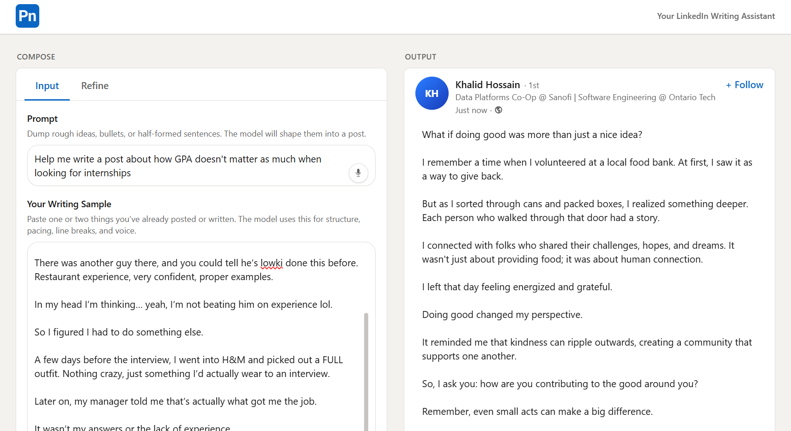
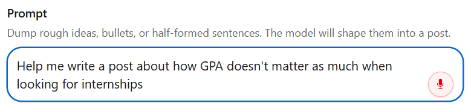
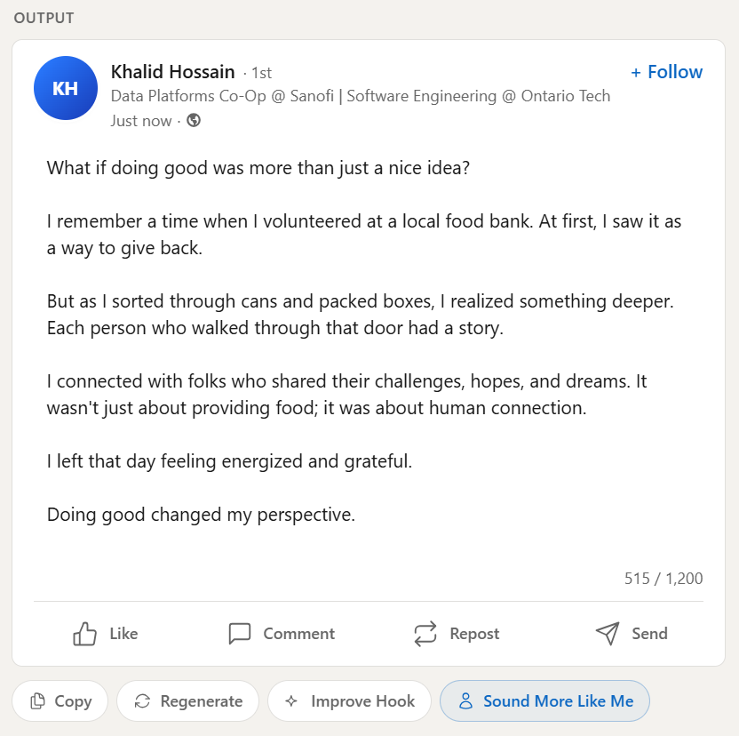
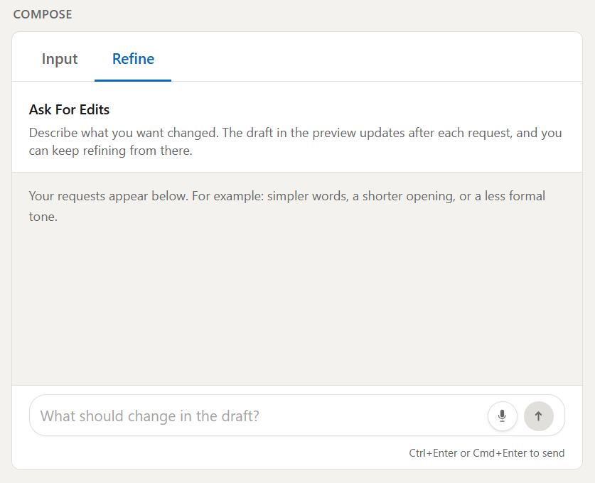
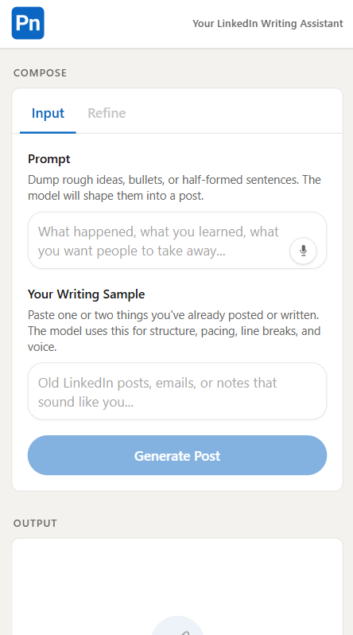
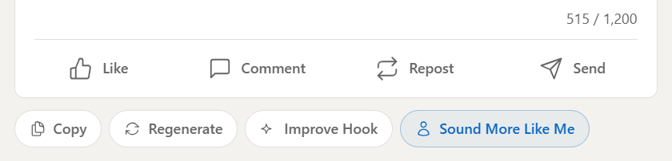
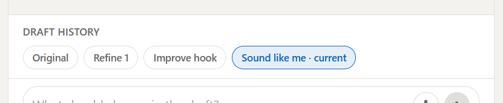

# PostedIn

**PostedIn** is a **LinkedIn-style writing assistant**. You drop rough notes into a **Prompt**, optionally add a **writing sample** so the tone matches yours, then hit **generate**. The draft **streams** into a feed-style **preview**, so you watch it take shape the way it would on LinkedIn instead of reading a wall of chat text.

You can refine in plain English, **jump back to older drafts** when something goes sideways, and use shortcuts like **Improve hook** or **Sound more like me** (after you add a sample). **Dictation** works in the Prompt and Refine fields anywhere your browser supports the mic.

When you **self-host** (clone the repo and use `.env.local`), you configure **your own** `OPENAI_API_KEY` on the server—see [§8 How to Run](#8-how-to-run). The **public demo** at **[postedin.vercel.app](https://postedin.vercel.app)** is deployed on Vercel and uses the **maintainer’s** key in project settings, so visitors do not paste or see an API key.

Nothing hits a database: refinement history stays in the **browser for that session only**.

**PostedIn Demo:** [postedin.vercel.app](https://postedin.vercel.app)

## Contents

| | |
|--|--|
| [1. Introduction](#1-introduction) | Logo / Product Mark |
| [2. Project Overview](#2-project-overview) | Full Workspace in One Frame |
| [3. Compose Workspace](#3-compose-workspace) | Prompt, Mic, Input Column |
| [4. Output Preview and Actions](#4-output-preview-and-actions) | Feed-Style Streaming Card |
| [5. Refinement and Draft History](#5-refinement-and-draft-history) | Refine Thread |
| [6. Responsive Layout and Accessibility](#6-responsive-layout-and-accessibility) | Narrow Viewport Stack |
| [7. Features, Model, and Stack](#7-features-model-and-stack) | Output Toolbar (Actions in UI) |
| [8. How to Run](#8-how-to-run) | Draft History / Session Workflow |
| [9. Restrictions and Platform Scope](#9-restrictions-and-platform-scope) | LinkedIn rules; no scraping |
| [10. License](#10-license) | MIT |

---

## 1. Introduction

If you want LinkedIn-ready text without living inside a chat app, this is basically: **compose**, **preview** like a real post, then **nudge** the copy until it feels right.

<p align="center">
  
  <br>
  <b>Figure 1: Product Mark for the Repo and Docs</b>
</p>

---

## 2. Project Overview

The layout is a **compose rail** on one side (Prompt, optional sample, tabs) and a **LinkedIn-style preview** on the other. The flow is simple: **Idea → Draft → Tweak**.

**Writing**

- **Prompt:** Paste bullets or paragraphs. This is the raw material for the first generation.
- **Writing Sample (Optional):** Paste old posts or emails so structure, line breaks, and voice line up. The same sample powers **Sound more like me** once a draft exists.

**Tabs and Generation**

- **Input / Refine Tabs:** **Input** holds the big text fields. **Refine** is a separate thread so you are not scrolling one endless column.
- **Streaming:** The preview **updates live** while the model writes. You are not waiting on a single blob of text at the end.
- **Refine with Context:** Each request sends the current draft plus **refinement history** so edits stay consistent. **Restore** older versions from **Draft history** chips or from a refine bubble when a newer version exists.

**Preview and Polish**

- **Output Card:** Edit in place in the preview. Under the card: **Copy**, **Regenerate**, **Improve hook**, and **Sound more like me** (when a sample is set).
- **Voice (Prompt and Refine Only):** The mic uses the **Web Speech API** (Chromium tends to behave best). It appends transcribed text. It does **not** apply to the writing sample field.
- **Cleanup:** After generation, the server normalizes punctuation (for example straight quotes instead of curly ones, and it strips **em dash** characters) so paste-out is less messy.

<p align="center">
  
  <br>
  <b>Figure 2: Nav, Compose Rail, and Preview in One Frame</b>
</p>

---

## 3. Compose Workspace

Use **Input** for the **Prompt** and **Your writing sample**. **Refine** sits on the other tab in the same rail. Before you have a draft, most of the work happens here: type, paste, or **dictate** into Prompt (the mic works in **Refine** too). A solid sample here pays off later for voice matching.

<p align="center">
  
  <br>
  <b>Figure 3: Prompt with Mic.</b> Include the sample field in the same capture if it reads better.
</p>

---

## 4. Output Preview and Actions

The post **streams** into a **feed-style card** so it reads like LinkedIn, not a chat bubble. Under the card you will see **Copy**, **Regenerate**, **Improve hook**, and **Sound more like me** when a sample is present. **Section 7** shows that toolbar in isolation.

<p align="center">
  
  <br>
  <b>Figure 4: Where the Draft Lands and Streams In</b>
</p>

---

## 5. Refinement and Draft History

**Refine** is where you ask for small, specific edits (“shorter,” “stronger CTA,” that kind of thing) without polluting the original Prompt. **Draft history** chips and **Restore this version** on bubbles help when a refine goes too far. **Section 8** shows the history UI.

<p align="center">
  
  <br>
  <b>Figure 5: Refine Thread for Iterative Edits</b>
</p>

---

## 6. Responsive Layout and Accessibility

Wide screens: **Compose** and **Output** sit side by side. Narrow screens: the same flow **stacks** so nothing feels bolted on for mobile. Compose uses proper tab panels, important controls have `aria` labels, and **Ctrl/Cmd+Enter** sends a refine where that shortcut applies.

<p align="center">
  
  <br>
  <b>Figure 6: Stacked Compose and Preview on a Small Viewport</b>
</p>

---

## 7. Features, Model, and Stack

### What the App Does (Implementation)

- **Next.js App Router:** `/api/generate` streams completions as **plain text** (`text/plain`) for a simple client.
- **OpenAI Chat Completions** (`gpt-4o-mini`): Fixed **system prompt** aimed at LinkedIn-shaped posts (hook, body, takeaway; length guidance is in the low thousands of characters in instructions).
- **Server Actions:** `generate`, `regenerate`, `refine`, `improve_hook`, `sound_like_me`. Payloads are validated and size-capped for self-hosted use.
- **Draft Checkpoints (Client):** After each successful AI update, a **checkpoint** stores post text and matching `refineTurns`. Restoring rolls back newer history so API calls stay consistent.
- **`sanitizePostOutput`:** Lives in `lib/sanitizePost.ts`. Runs after streams finish to normalize dashes and typographic quotes.
- **Layout:** Two columns on large screens, stack on small. Nav, borders, and type lean LinkedIn-adjacent via Tailwind tokens.

### Model Behavior

There is no “edit system prompt” screen. Behavior lives in code (`lib/openai.ts`). Roughly:

- Bias toward **human**, **non-buzzy** LinkedIn copy. Instructions avoid em dash characters, and post-processing still cleans punctuation.
- **Refine** should change **only** what you asked for unless you clearly want a bigger rewrite.
- **Improve hook** touches **opening lines only**. **Sound more like me** rewrites the **full** post using your **writing sample** as the reference.

### Tech List

| Piece | Role |
|--------|------|
| **Next.js 16** | App Router, RSC where it fits, streaming API route |
| **React 19** | Compose state, refine thread, checkpoints, stream handling |
| **TypeScript 5** | API payloads, checkpoint types, OpenAI params |
| **Tailwind CSS 4** | Layout, palette, components |
| **OpenAI Node SDK** | Chat completions from the server only |
| **Web Speech API** | Optional dictation (`components/VoiceDictateButton.tsx`) |

<p align="center">
  
  <br>
  <b>Figure 7: Output Toolbar Aligned With the Server Actions Above</b>
</p>

---

## 8. How to Run

**1. Clone and Install**

```bash
git clone https://github.com/KhalidHossainGitHub/PostedIn.git
cd PostedIn
npm install
```

**2. Environment**

```bash
cp .env.example .env.local
```

Open `.env.local` and add your [OpenAI API key](https://platform.openai.com/api-keys):

```
OPENAI_API_KEY=your_openai_api_key_here
```

Do **not** commit `.env.local` (it is gitignored). Everyone uses their own key.

**3. Dev Server**

```bash
npm run dev
```

Then open [http://localhost:3000](http://localhost:3000).

**4. Typical Flow**

- Fill **Prompt** (and **Your writing sample** if you want), then **Generate Post**.
- Open **Refine** for edits. Use **Draft history** or **Restore this version** on a bubble to undo.
- When it looks good, **Copy**. Otherwise try **Regenerate**, **Improve hook**, or **Sound more like me** from the output toolbar.

<p align="center">
  
  <br>
  <b>Figure 8: Draft History and Restore.</b> Session-only, browser storage, no database.
</p>

---

## 9. Restrictions and Platform Scope

PostedIn is a **standalone writing assistant**. It is **not** affiliated with LinkedIn, and it does **not** connect to your LinkedIn account.

**LinkedIn and member data**

LinkedIn’s terms and developer policies generally **do not allow scraping or automated collection of member data** (profiles, feeds, connections, etc.). That is a hard boundary for legitimate products. This app **never** pulls data from LinkedIn: you **paste** your own prompt, and you **optionally paste** a writing sample you already have. Anything you generate is based only on what **you** provide.

**What that meant for the build**

- No “log in with LinkedIn” or API flow to read your past posts from the network.
- No importing a profile or feed as a shortcut for tone or content; the sample field exists so **you** supply text you’re allowed to use.
- Copy and paste out to LinkedIn stays a **manual** step on purpose: you stay in control of what gets published.

**Live demo (hosted)**

The public deployment **[postedin.vercel.app](https://postedin.vercel.app)** runs on **Vercel** with **per-IP rate limiting** (Upstash) on `/api/generate` so casual abuse does not burn unlimited model usage. Self-hosted runs still rely on **your** OpenAI key and whatever limits you set in your account.

---

## 10. License

MIT
